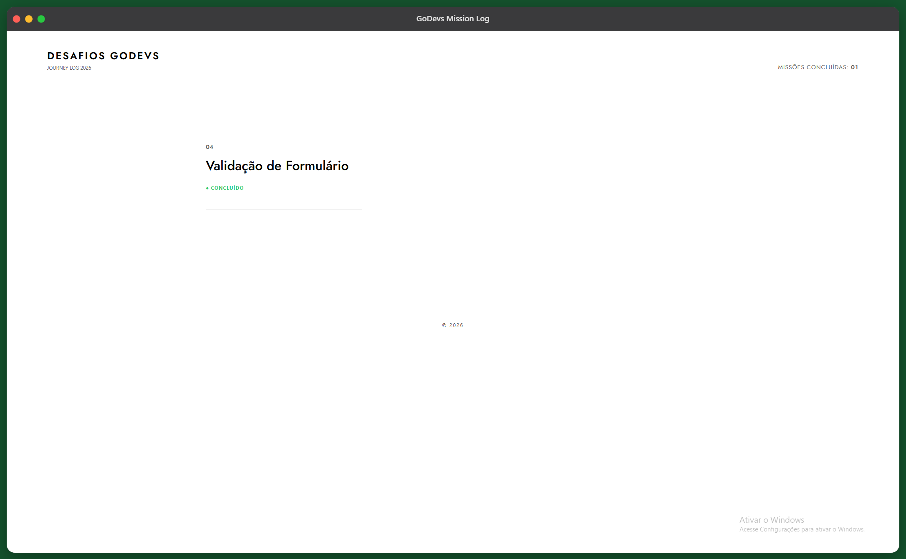

# 🏛️ GoDevs Mission Log
> **Status:** 🚀 Em desenvolvimento (Missão 04 Completa)  

<div align="center">
  
  <br>
  <sup>Visualização do Hub Central de missões utilizando grid assimétrico.</sup>
</div>

---

## 📖 Sobre o Projeto
Este repositório é o meu diário de bordo para os desafios propostos pela plataforma [godevs.in100tiva.com](https://godevs.in100tiva.com). 

O diferencial deste projeto é que ele não apenas resolve os desafios de lógica e estrutura, mas serve como laboratório para a criação de identidades visuais focadas em estética minimalista e layout editorial.

## 🏗️ Estrutura do Repositório
O projeto utiliza um sistema de **Micro-Frontends Estáticos**. Cada missão é independente e em geral (mas não como regra) apresenta uma identidade visual única.

```text
/
├── index.html           # Dashboard principal (Hub de navegação)
├── assets/              # Recursos globais (Imagens, Mockups)
└── missao_04/           # conteúdo da missão 04
    ├── assets/
    ├── index.html
    └── script.js
└── missao_xx/           # conteúdo da missão xx
    ...