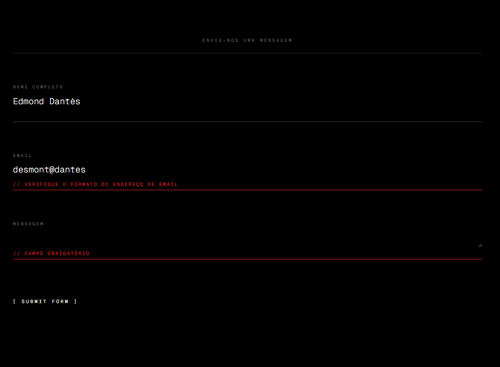

# 🚀 **Missão do Dia: Validação Simples de Formulário**

O objetivo desta tarefa é implementar uma checagem básica de campos em um formulário de contato para que o usuário não consiga enviar dados incompletos ou mal formatados. O foco é o lado do cliente (JavaScript), com feedback visual direto na interface.

## 🎨 Evolução do Design

O formulário segue um conceito escuro e minimalista, aproveitando utilitárias do Tailwind para garantir clareza e responsividade.

### 1. Fundamentos Visuais (Visual Foundation)

**Regra 60‑30‑10 (Dark Mode)**
- 60 % Fundo preto (`bg-black`).
- 30 % Cards e campos em cinza (`border-zinc-700/800`).
- 10 % Destaques brancos nos labels e interações.

**Espaço Negativo:** A seção possui `px-6 py-20` e utiliza `space-y-16` para espaçar cada bloco de campo, oferecendo respiro.

**Consistência:** Os inputs e textarea mantêm `border-b` com transições; labels e campos mudam juntos graças ao wrapper `.group`.

### 2. Hierarquia e Foco

**Tipografia Escalar:** Labels em `text-[9px]` acompanhados de tracking aumentado; campos textuais em `text-lg` garantem contraste entre rótulo e conteúdo.

**Cores Semânticas:**
- 🔵 Zinc‑500/700/800 para elementos neutros.
- 🔴 Red‑600 para indicar erro de validação.

**Proximidade:** Cada `label`, `input/textarea` e mensagem de erro pertencem ao mesmo container de flexão vertical, facilitando agrupamento lógico.

### 3. Interatividade e “Vida”

**Feedback tátil:** Os campos escurecem/clareiam com `focus-within` e são rapidamente válidos quando o usuário digita.

**Animação de underline:** O botão de envio usa uma pseudo‑classe (`.submit-label::after`) que cresce ao passar o mouse.

**Auto‑resize:** Textarea ajusta sua altura dinamicamente conforme a digitação sem scripts pesados.

### 4. Padrões de UX

**Interceptação de Submit:** A função de `submit` previne comportamento padrão para validar localmente.

**Validações:**
- Campos não podem ficar vazios.
- Validação de formato de email via regex.
- Mensagens de erro aparecem abaixo do campo com `opacity` animada.
- O estado de erro é removido assim que o usuário começa a corrigir o input.

**Simulação de API:** Uma pausa de 4 s com opacidade reduzida no formulário e mensagem de sucesso pulsante (`animate-pulse`) simulam envio/recepção.

### 5. Estética Avançada (Polish)

Embora não haja glassmorphism ou orbs, o projeto utiliza um estilo limpo com letra monoespaçada (**Geist Mono**), espaço generoso e transições suaves para conferir pro‑fundo e modernidade.

---

## 🛠️ Tecnologias Utilizadas

- **HTML5 & CSS3** (via Tailwind CDN) para marcação e estilo.
- **JavaScript (Vanilla)** para lógica, validações e manipulação do DOM.
- **Google Fonts (Geist Mono)** para tipografia minimalista.

> O código é minimalista e autocontido, não requer bundlers ou dependências externas além do CDN do Tailwind.

---

## 🚀 Como Executar

1. Abra `missao_04/index.html` em qualquer navegador moderno.
2. Não há necessidade de servidor ou instalação adicional.

---

## 🧩 Funcionalidades Lógicas

- Prevenção do envio automático (interceptação de `submit`).
- Verificação de campos vazios e formato de email.
- Feedback visual de erro com bordas e texto em vermelho.
- Estado de validação reverte ao digitar.
- Simulação de espera na “API” com mensagem de sucesso animada.

## 📁 Arquivos envolvidos

- `index.html` — estrutura e estilos (Tailwind) do formulário
- `script.js` — onde toda a lógica descrita acima deve residir

---